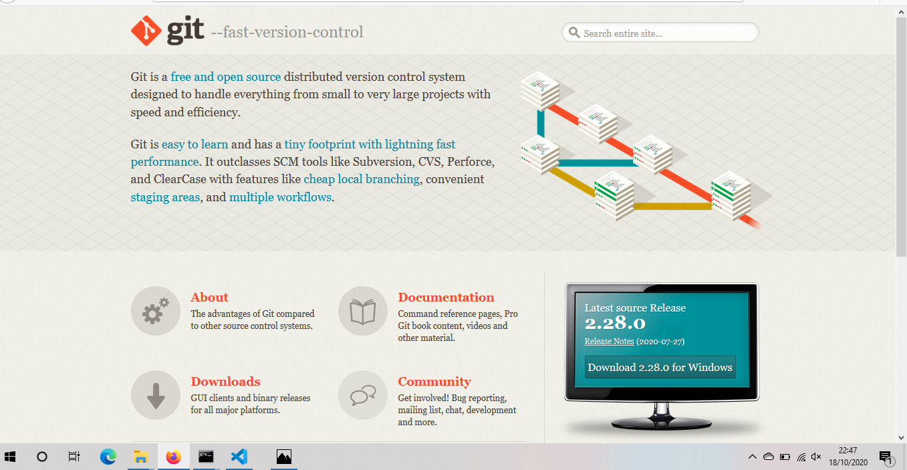
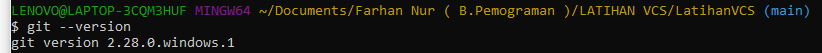
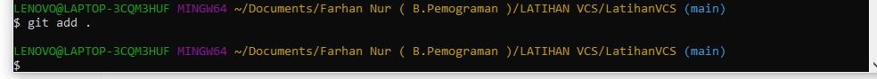
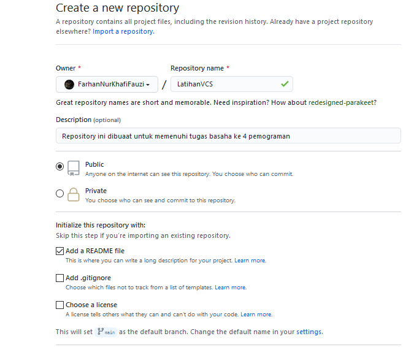

# LatihanVCS
Repository ini dibuaat untuk memenuhi tugas basaha ke 4 pemograman

Nama : Farhan Nur Kahfi Fazui
Nim : 312010087
Kelas : TI.20.B.1

#langkah-langkah pembuatan VCS 

* Pertama download Git

* cek version di git bash

* git add

* lalu buat akun git hub

* lalu buat repository 

* langkah selanjutnya copy link github
* setelah itu gt clone di folder
* git commit
* dan langkah selanjunya edeit file README.md
* setelah itu ke git add
* langkah selanjutnya git commit
* git push
* lalu ke github